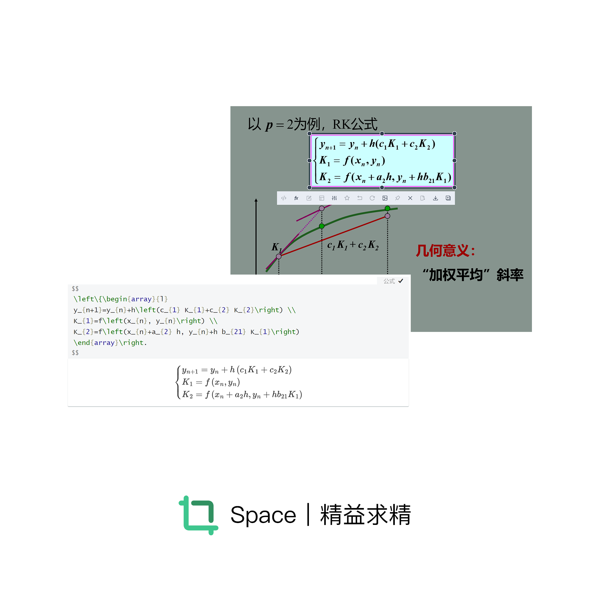

# 🧱更新记录

>Note: 版本号为 **A.B.C** 其中
>
>**A**: 结构性修改 
>
>**B**: 加入新功能
>
>**C**: 修复BUG、优化性能

### 1.4.1

#### 🛠优化

1. 加入了网络连接情况检测，针对需要网络连接的功能进行提示

#### 💉修复BUG

1. 修复了1.4.0版本连续调用OCR闪退的异常
2. 进一步修复程序内存泄漏问题

## 1.4.0

#### 🎊新特征

1. 新增OCR功能，接入百度OCR API
2. 对于OCR结果进行智能分析：当返回单条数据时直接添加到剪切板；当返回多条数据时，智能分析段落组成
3. 支持按住CTRL滑动鼠标快速选取OCR结果中的所需行

#### 💉修复BUG

1. 修复1.3.0版本下无法保存图片的问题
2. 修复了程序的内存泄漏问题

## 1.3.0

#### 🎊新特征

1. 全功能适配macOS，后续版本将同步适配mac和win32

### 1.2.3

#### 💉修复BUG

1. 修复了仅在主屏幕上进行截图

#### 🛠优化

1. 工具栏按钮提示加入提示栏（Hint级别）
2. 支持显示原生Mathpix返回结果（ERROR级别）

### 1.2.2

#### 💉修复BUG

1. 125%缩放下截图区域异常

### 1.2.1

#### 💉修复BUG

1. 修复了多线程造成的图片获取延迟

#### 🛠优化

1. 优化了默认快捷键

## 1.2.0

#### 🎊新特征

1. ✨对接Mathpix API，可直接对截图进行latex公式提取
2. 加入PromptDock以显示提示信息

### 1.1.1

#### 🛠优化

1. ✨分离后处理操作线程，使用更平滑，优化体验
2. 分离工具：类型转化`Util::CvtFormatUtil`、XML操作类`Util::XmlUtil`

## 1.1.0

#### 🎊新特征

1. ✨实现对截图区域的移动、拉伸、再截图
2. 兼容高分辨率屏幕

## 1.0.0

#### 🎊新特征

1. ✨构建可视化工具条，实现工具条的**最近操作原则**和**不溢出原则**

   1. 最近操作原则：工具条的出现位置一定与截图结束时鼠标位置最接近
   2. 不溢出原则：工具条一定会完整显示在屏幕内

2. 建立设置界面，创建本地配置文件

3. 确立程序整体结构，分离截图模块和后处理模块

4. ✨实现背景去除，Windows版本支持CF_BID，"PNG"，MimeData三种输出到剪切板的形式

   > 暂未找到方案统一Windows上不同软件的接纳格式

## 0.1.0

#### 🎊新特征

1. 构建截图模块，实现主屏幕截图的剪切板存放和磁盘保存
2. 绑定全局截图快捷键
